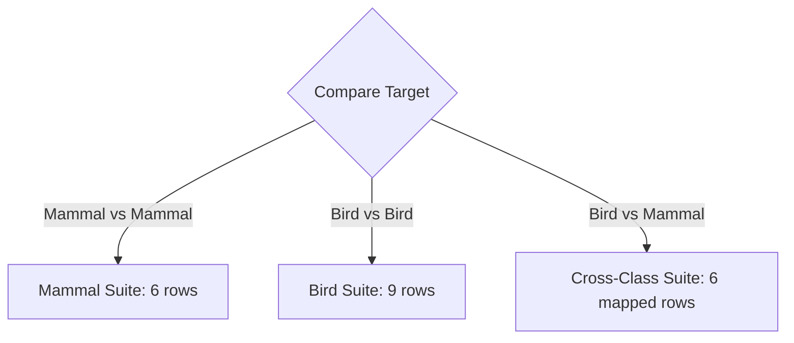

# Plan: Class-Aware Dynamic Measurement Architecture

## 1. Core Data Model & CSV Structure

To keep all collection data in unified canonical CSV files (`taxa.csv` and `specimens.csv`) without duplicating tables, we expand `specimens.csv` with the bird-specific measurement columns.

### Measurement Definitions by Class

| Measurement Field | Label | Unit | Applicable Class |
|---|---|---|---|
| `skull_length_mm` | Maximum skull length | mm | Mammals & Birds |
| `skull_mass_g` | Prepared skull mass | g | Mammals & Birds |
| `cranium_width_mm` | Cranium width | mm | Mammals & Birds |
| `mandible_length_mm` | Maximum mandible length | mm | Mammals & Birds |
| `body_mass_g` | Animal body mass | g | Mammals & Birds |
| **`skull_width_mm`** | Maximum skull width | mm | Mammals only |
| **`skull_height_mm`** | Skull height | mm | Mammals only |
| **`condylobasal_length_mm`** | Condylobasal length | mm | Mammals only |
| **`rostrum_width_mm`** | Rostrum width | mm | Mammals only |
| **`maxillary_tooth_row_length_mm`** | Maxillary tooth-row length | mm | Mammals only |
| **`mandibular_tooth_row_length_mm`** | Mandibular tooth-row length | mm | Mammals only |
| **`mandible_ramus_height_mm`** | Mandibular ramus height | mm | Mammals only |
| **`mandible_body_height_mm`** | Mandibular body height | mm | Mammals only |
| **`maxillary_canine_length_mm`** | Maxillary canine length | mm | Mammals only |
| **`mandibular_canine_length_mm`** | Mandibular canine length | mm | Mammals only |
| **`bill_length_mm`** | Bill length | mm | Birds only |
| **`bill_width_mm`** | Bill width | mm | Birds only |
| **`bill_height_mm`** | Bill height | mm | Birds only |
| **`orbital_width_mm`** | Orbital width | mm | Birds only |
| **`interorbital_width_mm`** | Interorbital width | mm | Birds only |
| **`cranium_height_mm`** | Cranium height | mm | Birds only |

### Strict Status Semantics
- When a specimen is a **Bird**, mammal-only fields (e.g. `maxillary_canine_length_mm`, `skull_width_mm`) receive status **`not_applicable`**.
- When a specimen is a **Mammal**, bird-only fields (e.g. `bill_length_mm`, `orbital_width_mm`) receive status **`not_applicable`**.
- When an applicable measurement was not taken, it receives status **`not_recorded`**.

---

## 2. Dynamic Specimen Exhibit Table (`MeasurementPanel.tsx`)

The exhibit table inspects the taxon's class (`classSlug` or `className`) to render the anatomically appropriate layout:

### A. Birds (`Aves`)
* **Primary Display (Main list):**
  1. Maximum skull length (`skullLength`)
  2. Bill length (`billLength`)
  3. Bill width (`billWidth`)
  4. Bill height (`billHeight`)
  5. Cranium width (`craniumWidth`)
  6. Cranium height (`craniumHeight`)
  7. Orbital width (`orbitalWidth`)
  8. Maximum mandible length (`mandibleLength`)
  9. Prepared skull mass (`skullMass`)
* **Additional recorded data (`
` disclosure):**
  * Interorbital width (`interorbitalWidth`)
  * Animal body mass (`bodyMass`)

### B. Mammals (`Mammalia`)
* **Primary Display (Main list):**
  1. Maximum skull length (`skullLength`)
  2. Maximum skull width (`skullWidth`)
  3. Skull height (`skullHeight`)
  4. Cranium width (`craniumWidth`)
  5. Maximum mandible length (`mandibleLength`)
  6. Prepared skull mass (`skullMass`)
* **Additional recorded data (`
` disclosure):**
  * Condylobasal length (`condylobasalLength`)
  * Rostrum width (`rostrumWidth`)
  * Maxillary tooth-row length (`maxillaryToothRowLength`)
  * Mandibular tooth-row length (`mandibularToothRowLength`)
  * Mandibular ramus height (`mandibleRamusHeight`)
  * Mandibular body height (`mandibleBodyHeight`)
  * Maxillary canine length (`maxillaryCanineLength`)
  * Mandibular canine length (`mandibularCanineLength`)
  * Animal body mass (`bodyMass`)

---

## 3. Dynamic Comparison Differences Matrix (`MeasurementDifferences.tsx`)

The comparison engine resolves the difference rows dynamically based on the pair of classes being compared:

### Matrix Resolution Table

### 1. Mammal vs. Mammal (6 rows)
* Max length (`skullLength`)
* Max width (`skullWidth`)
* Max height (`skullHeight`)
* Cranium width (`craniumWidth`)
* Max mandible length (`mandibleLength`)
* Prepared skull mass (`skullMass`)

### 2. Bird vs. Bird (9 rows)
* Max length (`skullLength`)
* Bill length (`billLength`)
* Bill width (`billWidth`)
* Bill height (`billHeight`)
* Cranium width (`craniumWidth`)
* Cranium height (`craniumHeight`)
* Orbital width (`orbitalWidth`)
* Max mandible length (`mandibleLength`)
* Prepared skull mass (`skullMass`)

### 3. Cross-Class (Bird vs. Mammal or Mammal vs. Bird) (6 rows)
We map equivalent functional dimensions:
1. **Max length:** `skullLength` ↔ `skullLength`
2. **Width (Orbital / Max width):** Bird `orbital_width_mm` ↔ Mammal `skull_width_mm` *(labeled as "Width (orbital ↔ max)")*
3. **Height:** Bird `cranium_height_mm` ↔ Mammal `skull_height_mm` *(labeled as "Height (cranium ↔ skull)")*
4. **Cranium width:** `craniumWidth` ↔ `craniumWidth`
5. **Max mandible length:** `mandibleLength` ↔ `mandibleLength`
6. **Prepared skull mass:** `skullMass` ↔ `skullMass`