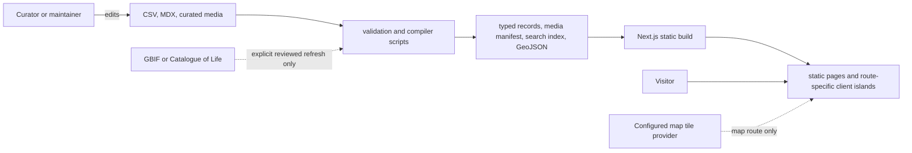

# Architecture

**Status:** Accepted baseline; measurement-reference compilation and route-scoped interaction architecture implemented

**Last reviewed:** 2026-08-31

## 1. Architectural goals

The architecture must make a photographically rich catalog feel fast while protecting scientific and curatorial integrity. It is optimized for:

- static, indexable public content;
- deterministic builds without live taxonomy, map, or database dependencies;
- human-editable structured source data with strict validation;
- stable taxon/specimen identity and URLs;
- small, isolated interactive surfaces;
- accessible alternatives to visual interactions;
- reviewable changes in a public Git repository; and
- a future path to more records, external media storage, and richer media without rewriting page code.

## 2. Technology baseline

| Concern | Decision | Why |
|---|---|---|
| Runtime | Node.js 24.18.0 LTS | Current approved LTS line; pinned locally and in CI |
| Package manager | pnpm 11.21.0 | Exact, reproducible installs and efficient store |
| Web framework | Next.js 16.2.12 App Router | Static generation, server components, metadata, image pipeline, and Vercel path |
| UI runtime | React/React DOM 19.2.8 | Compatible pinned stable release |
| Language | TypeScript 6.0.3, strict mode | Newest release supported by the current Next.js ESLint stack; explicit domain boundaries and early contract failures |
| Styling | Tailwind CSS 4.3.3 plus CSS variables | Semantic design tokens with small custom museum components |
| Structured content | Two CSVs plus cited MDX | Familiar editing, Git diffs, schema validation, and suitable prose |
| Search | Orama 3.1.18 | Browser-side weighted search over deterministic generated documents; pinned exactly |
| Map | MapLibre GL JS, added in Phase 5 | Provider-independent interactive vector map |
| Media processing | Sharp 0.35.3 | Deterministic metadata stripping, validation, bounds, and derivatives |
| Unit/component tests | Vitest, Testing Library, axe | Fast domain and UI feedback |
| Browser tests | Playwright with axe | Real navigation, responsive, and accessibility smoke coverage |
| CI | GitHub Actions | Reproducible pull-request gate |
| Hosting | Vercel, configured in Phase 7 | Preview deployments and Next.js production integration |

Patch dependencies are pinned in `package.json`/`pnpm-lock.yaml` and updated through reviewed Dependabot pull requests. Major or architecture-changing upgrades require an ADR.

## 3. System context



Normal builds read committed local sources and snapshots only. The dotted external connections are optional maintenance/runtime presentation concerns, never canonical record stores.

## 4. Runtime and build boundaries

### Server/static by default

Routes, layouts, metadata, taxonomy trees, record selection, and editorial content use React Server Components and static generation. Known dynamic segments expose `generateStaticParams`. This keeps HTML complete, JavaScript smaller, and records indexable.

### Client islands only where interaction requires state

Implemented/planned client boundaries are:

- global/catalog search and suggestions;
- URL-backed faceted filters and result-mode controls;
- gallery thumbnail, swipe, high-resolution inspection, zoom/pan, and guidance-dialog controls;
- calibrated skull comparison, responsive scaling, difference display, and its scoped searchable selector;
- compact multi-specimen chooser dialogs; and
- the `/methodology` annotation/preview/detail surface over a complete static diagram-and-table rendering;
- a future Phase 3.3 comprehensive tree enhancement over the current semantic taxonomy drawer/list; and
- the MapLibre map synchronized with a server-renderable result list.

Client modules may receive serialized domain view models. They must not import filesystem/compiler code or become a parallel data-access layer.

### No v1 application backend

There are no accounts, public forms, mutations, database calls, server actions for collection data, or runtime content administration. Contact uses a reviewed direct contact link. A backend is introduced only through a later architecture decision.

## 5. Source-to-page pipeline

```text
content/taxa/taxa.csv
content/specimens/specimens.csv
content/profiles/*.mdx
content/guides/*.mdx
content/media/*.json
content/references/*.json
content/methodology/measurement-definitions.csv
content/methodology/measurement-reference.json
staged, normalized specimen images
staged, reviewed comparison-reference images
staged, reviewed raw/annotated measurement reference pairs
                  │
                  ▼
scripts: parse → validate → link → enrich from reviewed snapshots → process media
                  │
                  ▼
.generated/ (ignored): typed JSON, media manifests, measurement reference, search documents, map GeoJSON
public/generated/ (ignored): versioned browser-fetchable search artifact
                  │
                  ▼
domain/query modules → statically generated routes → small client islands
```

Rules:

- CSV and MDX are editable sources; generated JSON is replaceable output.
- The application never parses the original working spreadsheet at runtime.
- Build failure is preferred to silently dropping or coercing invalid published content.
- Draft rows may be incomplete but must parse safely and remain excluded from public output.
- Generated paths are ignored and regenerated in CI.

Phase 2 implements this pipeline with `content:build`, `validate:content`, `validate:media`, and committed invalid fixtures. `.generated/collection.json`, `.generated/media-manifest.json`, and `.generated/comparison-reference-manifest.json` are deterministic ignored outputs regenerated before application builds and relevant tests. Phase 2.1 advanced the compiled collection contract to schema version 2 for condition, pathology, trauma, teeth-set, and skeleton fields. Phase 2.2 advanced it to schema version 3 for explicit lateral orientation and typed comparison-reference records. Phase 3 advances it to schema version 4 for unified class-aware measurement fields, profile applicability validation, and hierarchy-name/slug consistency. The Phase 3.2/4 content build also writes the same versioned 67-document search artifact to `.generated/search-documents.json` and `public/generated/catalog-search-v1.json`; both copies are ignored and replaceable. The Measurements milestone adds `.generated/measurement-reference-v1.json`, compiled from the reviewed 21-row definition CSV and five-view coordinate manifest; the client board handles movement-aware tap dismissal and compact, viewport-aware tooltip/detail positioning, while a normal build never reads the ignored annotated/raw staging sources. Generated artifacts are never migrated in place.

## 6. Repository boundaries

```text
src/app/              routes, layouts, route metadata, error/loading surfaces
src/components/       reusable museum UI and route-specific interactive islands
src/config/           public site/runtime configuration
src/domain/           pure types, executable schemas, compiler, normalization, invariants
src/data/             generated-data loading and read-only queries
src/features/         exhibit, catalog/search, and route-isolated map islands
src/styles/           optional token/component layers if globals grow
content/taxa/          canonical taxon CSV
content/specimens/     canonical specimen CSV
content/profiles/      cited taxon-profile MDX
content/guides/        editorial guide MDX
content/media/         specimen-media declarations
content/references/    calibrated comparison-reference declarations
content/methodology/   measurement definitions plus registered view/overlay declarations
public/media/          curated public web derivatives only
public/generated/      ignored browser-fetchable build artifacts only
scripts/               build-time content, taxonomy, and image tooling
tests/e2e/             cross-route browser and accessibility journeys
docs/                  canonical product/technical documentation and ADRs
agent_context/         local planning/source context; private paths ignored
```

Dependency direction is inward toward pure domain contracts:

```text
app/features → components/data queries → domain contracts
scripts      → domain contracts
domain       → no framework, browser, filesystem, or generated-artifact dependency
```

## 7. Domain identity and URLs

- `taxon_id` and `specimen_id` are immutable local identifiers.
- A taxon slug is a curated public identifier, not a live function of the current scientific name.
- A renamed taxon keeps its ID and previous route through an explicit redirect.
- Every published taxon identifies exactly one published default specimen.
- `/species/{taxon-slug}` renders the default specimen within the taxon exhibit.
- `/species/{taxon-slug}/specimens/{specimen-id}` selects one exact linked specimen.
- A specimen cannot move to a different taxon silently; such a correction is a reviewed migration.

See [content_data_model.md](content_data_model.md) and [ADR 0005](decisions/0005-species-and-specimen-url-model.md).

## 8. Content compilation and validation

The Phase 2 compiler uses strict Zod schemas at the input boundary and returns typed canonical records. It:

1. read UTF-8 CSV and MDX sources;
2. normalize headers and controlled tokens without rewriting identity;
3. preserve raw display strings and missing-value semantics;
4. validate individual fields;
5. link specimens, taxa, defaults, optional profiles, citations, specimen media, and comparison references;
6. enforce published-record invariants;
7. derive the measurement profile from the linked taxon's class and reject invalid `not_applicable`/profile combinations;
8. ensure repeated hierarchy rank names/slugs/parents are consistent for static routes;
9. generate deterministic, sorted artifacts; and
10. report errors with source file, row/key, field, invalid value, and recovery guidance.

The content build and application build are separately invocable and composable in CI. Invalid public records fail before Next.js renders routes. `pnpm build` composes them and explicitly uses Next.js's supported webpack production compiler: the pinned Turbopack build did not terminate reliably during Phase 2 verification, while webpack produced deterministic static output. Reverting to the default compiler requires a focused toolchain check, not an unreviewed script edit.

An editorial profile is not a publication prerequisite for a valid taxon/specimen route. Draft profiles may retain the canonical heading structure with empty sections and no citations. The page query returns only `reviewed` profiles; this keeps the parser, citations, and rendering path ready without publishing placeholder prose. Reviewed profiles still require substantive sections and claim-level citation integrity.

### Phase 3.2 catalog and taxonomy query boundary

`src/domain/catalog/queries.ts` converts a compiled collection into deterministic, framework-free view models for published counts/rank statistics, class entries, rank nodes/lineages, the class → order → family → genus → taxon browser tree, family gallery groups, taxon cards with exact specimen options, specimen cards, slug resolution, and bounded related suggestions. `src/data/catalog.ts` is the server-side adapter used by pages, sitemap, and metadata. Pages never traverse raw CSV rows or reconstruct hierarchy URLs independently.

Known class/order/family/genus nodes become `generateStaticParams` entries for one shared rank template. Taxon pages resolve current and previous slugs, keep default-specimen selection canonical, and exact specimen cards/URLs remain nested. Draft taxa/specimens are excluded before counts, cards, routes, sitemap, and search documents are produced. The Phase 3.2/4 catalog composes these serialized view models with generated search matches and pure filter/state modules; it does not create a second record or taxonomy model.

The statically prerendered `/species` HTML contains the default published cards and a complete no-JavaScript taxonomy alternative. One catalog client island receives the serialized model and owns URL state, filtering, sorting, modes, suggestions, and the responsive taxonomy drawer. The drawer/list/rank links use the same node records; class/order/family/genus selection filters the catalog while an explicit link opens the stable rank route. The compact multi-specimen dialog remains a separate presentation-only island with exact links. The comprehensive Phase 3.3 visualization must preserve this tree/list/route parity; see [interactive_taxonomic_tree.md](interactive_taxonomic_tree.md).

## 9. Taxonomy maintenance

Scientific names are checked through an explicit maintenance command using the current Catalogue of Life Extended Release via GBIF's species matching service.

- The command is never part of `pnpm build`.
- Results are stored as a dated local snapshot with query, match, rank, status, identifiers, confidence, and review state.
- Exact accepted matches may update verification metadata.
- Fuzzy, synonym, conflicting, or higher-rank results require human review and never rewrite supplied identification automatically.
- Curated Danish names are not machine-translated.
- External identifiers are nullable references, not primary keys.

This preserves reproducible builds when external taxonomy services change or fail.

## 10. Search architecture

The integrated Phase 4 compiler emits three Orama document types from published canonical records:

- taxonomic rank documents;
- taxon documents; and
- specimen documents.

The current artifact contains 34 rank, 15 taxon, and 18 specimen documents. Scientific, English, Danish, alias, specimen-ID, taxonomy, and optional reviewed-profile fields are normalized with explicit Danish `æ`/`ø` transliteration followed by NFKD/diacritic, punctuation, whitespace, and case folding without changing display values. Orama provides broad candidate retrieval; one deterministic acceptance policy then applies exact → prefix → alias/synonym → credible fuzzy → profile-text tiers to both suggestions and result filtering. Normal words allow at most one edit, two edits are reserved for long tokens, multi-word fuzziness compares complete values rather than unrelated shared tokens, and `SPEC-`/`TAX-` queries use strict identifier-prefix semantics. This prevents suffix similarity such as `Canidae`/`Laridae` or a shared `SPEC-00` prefix from admitting unrelated records while retaining useful corrections such as `Racoon dog`. Result URLs and lateral thumbnails come from canonical domain records and `MediaAsset` declarations.

`CatalogExplorer` does not import Orama in its initial module. After a non-empty query, it dynamically imports the engine and fetches `/generated/catalog-search-v1.json`; unrelated routes and the query-empty catalog do not request the index. Schema-version mismatch or fetch failure produces an honest search error without changing canonical content.

URL parameters are the source of truth: `q`, `mode`, `class`, `scope={rank}:{slug}`, comma-separated `sex`/`age`/`condition`/`preparation`, `lengthMin`, `lengthMax`, `massMin`, `massMax`, `sort`, and `direction`. Parsing rejects invalid slugs, ranks, tokens, directions, and negative/non-finite numbers. Push/replace history and `popstate` restore meaningful state on direct load, refresh, back, and forward; transient filter/taxonomy-panel open state stays out of the URL.

Species mode retains a taxon when at least one linked specimen matches and reports matched/total count plus recorded length/mass ranges. A species numeric sort uses the largest recorded matching specimen as the taxon's sort key, visible lateral representative, and exact card link; if the measurement is unavailable, the reviewed default remains the visual fallback. Specimen mode compares individual exact cards. Numeric filters exclude `not_recorded`/`not_applicable` measurements instead of treating them as zero, and unknown values remain last in both directions. Family groups is a real grouped presentation in both result modes; explicit name/measurement sorts flatten results globally. All sorts are bidirectional and survive result-mode changes.

Search never creates a second classification model. Filters and suggestions use the same compiled records as static pages.

## 11. Map architecture

Phase 5 emits `.generated/map-records-v2.json` deterministically from the compiled published collection. It contains one sorted semantic record per published specimen plus point GeoJSON only for valid exact/approximate coordinates. The v2 projection keeps canonical latitude/longitude unchanged and adds deterministic presentation-only plot coordinates for coincident approximate records, so each uncertain point can remain selectable at high zoom without changing the represented location or its uncertainty area. Location labels, coordinate precision, uncertainty radii, lateral `MediaAsset` references, and exact record URLs remain canonical specimen-derived fields; unknown coordinates stay list-only and are never geocoded.

- The statically generated `/map` route server-renders the operational shell and complete specimen list. A client loader capability-checks WebGL and dynamically imports the MapLibre canvas chunk only on this route.
- `provider.ts` is the replaceable OpenFreeMap adapter for Fiord, Dark, Positron, Liberty, and Bright style URLs. The provider owns only basemap presentation; collection state and identity never leave the application model.
- URL-backed map state reuses catalog query/scope/facet/range vocabulary and adds exact `specimen`, supported `style`, and explicit `uncertainty` state. Camera center/zoom remain transient.
- MapLibre clusters the filtered point projection. The screen-space radius stays close to the marker footprint, and clustering remains available through zoom 16 so coincident uncertain points do not silently collapse into one selectable point before their presentation offsets separate. Every rendered cluster also has a synchronized DOM button with an accessible count; complete membership comes from `getClusterLeaves`, with no top-N truncation.
- The cluster radius is calibrated to marker-scale screen pixels so points stay separate until near physical contact. Accessible cluster controls are mounted inside MapLibre's interactive canvas container so wheel input over a marker or cluster remains map input. Desktop popup placement is locked to the left and clamped to the map viewport; individual popup wheel/touch input is contained while cluster-list scrolling remains available.
- Mammal, bird, and fallback marker icons are local generated images. Approximate points gain a separate outline, selection gains a high-contrast ring, and text in the list/popup always carries precision meaning.
- Positive uncertainty radii become deterministic geodesic polygons. The selected approximate record's polygon is automatic; the global toggle controls all other eligible areas.
- The map keeps a transient camera snapshot across basemap-style remounts. Popup close preserves that camera for unfiltered exploration and fits only the active filtered records when a collection query/filter is active.
- Desktop keeps an independently scrollable result rail beside the map, open by default with an explicit hide/show control. Medium/mobile layouts use a bounded result drawer/sheet. Its compact rows pair the scientific and Danish names, immutable ID, locality/date, enlarged lateral thumbnail, and exact specimen link without repeating marker-precision prose. The same complete links survive no JavaScript, no WebGL, provider failure, and MapLibre worker/style failure.
- The map key reuses the actual local mammal/bird marker assets for the class rows, represents approximate locations with the map's outer ring alone, and uses a circular dashed uncertainty glyph. It omits a redundant exact-location row because exact points use the base class marker; explicit precision wording remains in specimen popups. Its disclosure remains visible on narrow screens instead of being clipped by the active-state scroller.
- Specimen Collection records link to `/map?specimen={id}` when a public point exists. Home remains a lightweight non-cartographic preview but now links to the functioning central map.

The `/map/:path*` security header permits only same-origin application assets, blob workers/images, and `https://tiles.openfreemap.org`; it does not add wildcard providers, analytics, cookies, or tracking. Development adds `unsafe-eval` only for React/Turbopack diagnostics; the production header never includes it.

## 12. Media architecture

Archival `.af`, PSD, TIFF/PNG masters, and camera originals live in backed-up private storage outside Git. `agent_context/skull_images_clean/` is local staging, not a public source directory.

The Phase 2/2.2 Sharp workflow, reused for the Phase 3.1 104-image review slice:

- validates `{specimen-id}__{canonical-view}` naming;
- reads orientation and converts pixels to sRGB;
- strips EXIF, GPS, and unnecessary metadata;
- verifies dimensions, alpha channel/edges, linked IDs, expected views, and file size;
- calculates transparent subject bounds used by the gallery and calibrated comparison; and
- writes a transparent WebP master up to 3200 px, quality 90, alpha quality 100.

Curated web masters are committed under `public/media/specimens/`. The active gallery loads the validated full-resolution WebP through an SVG `viewBox` derived from the compiled alpha subject bounds, so transparent margins do not make the skull appear small and anatomy is not cropped. `next/image` still creates controlled lightweight thumbnail variants. The inspection viewer deliberately loads the validated original 3200 px WebP, preventing a smaller responsive derivative from being enlarged as a false high-resolution view.

The committed `scripts/phase-3-1-review-media-source-map.json` is the reproducible filename-to-ID/view map for this bounded migration. It points only into the ignored staging root and cannot make a normal build depend on raw PNGs. `pnpm media:stage:phase3.1` copies those explicitly mapped sources into ignored staging; the ordinary processor then writes/validates the curated derivatives. Four accepted specimens intentionally omit the optional frontal view and compile with warnings, not fabricated files.

Phase 3.2 corrected the six lateral/oblique derivatives for SPEC-0003, SPEC-0013, and SPEC-0018 by restaging their already right-facing reviewed clean masters and regenerating the WebPs through this same processor. This intentionally avoids manual public-file edits: validation recomputes alpha subject bounds, strips metadata, and proves that only the six expected derivatives changed. Lateral declarations already identified those views as right-facing; pixels and metadata now agree.

The gallery client island owns selection, direct controls, keyboard navigation, touch swipe, double-click/double-tap entry, and the native `<dialog>` inspection viewer. The ordinary stage declares browser `manipulation` (`pan-x pan-y pinch-zoom`) so a two-finger pinch may translate while scaling and the zoomed visual viewport may pan in any direction inside the frame. Default-preserving touch observation changes gallery view or opens inspection only when a single-touch gesture began and ended at approximately 100% page scale; zoomed-page pans and any multi-touch gesture remain entirely browser-owned. Inside inspection, a horizontal touch swipe changes view only at 100%; after enlargement, one finger pans and two fingers control image zoom. A non-passive wheel handler captures ordinary wheel/trackpad input and browser-reported pinch-wheel input only over the inspector, centers zoom on the gesture, prevents background scroll/page zoom, and leaves Arrow/Home/End view navigation active at any zoom. Pan is constrained to the enlarged image, the document is scroll-locked while the modal is open, and focus returns to the opening control. Desktop and mobile-landscape layouts use an independently scrollable right rail; mobile portrait keeps view buttons below the image. Core record content and a no-JavaScript image list remain server-rendered.

Comparison-reference sources use stable IDs under `content/references/`, are processed from ignored local staging through `pnpm media:process:reference`, and are committed only as reviewed WebP derivatives under `public/media/references/`. They pass the same sRGB, alpha, dimensions, subject-bounds, and metadata-stripping checks as specimen assets. Exactly one reference is the default.

Measurement methodology sources remain ignored under `agent_context/measurement_page/`. `pnpm media:verify:methodology-sources` proves exact annotated/raw dimensions, identity canvas registration, correspondence between each encoded primary line/label and the annotation pixels, and the owner-corrected shared/extended dashed guides. `pnpm media:process:methodology` publishes only the five unannotated, transparent, sRGB, metadata-stripped WebPs under `public/media/methodology/`. The canonical overlay manifest retains the original 6000×4000 or 6200×4133 coordinate system and adds an in-bounds presentation viewport per figure; image and SVG are transformed together, so empty transparent canvas can be cropped without altering source pixels or registered coordinates.

Page code consumes `MediaAsset` records rather than constructing filenames. That interface permits a later object-store/CDN migration when public media approaches approximately 500 MB.

## 12.1 Calibrated comparison architecture

The specimen-page comparison is a route-independent feature under `src/features/comparison/`, backed by pure calculations in `src/domain/comparison/` and eligible-record queries in `src/data/comparison.ts`.

- An eligible specimen is its taxon's published default specimen and has a valid lateral asset plus measured maximum skull length.
- The current specimen stays primary. The default adult-human reference is first in the selector; the current specimen is excluded.
- Each lateral declaration records `left` or `right`; the comparison image flips in presentation when necessary and source pixels remain unchanged.
- The shared scale is derived once from the available visual width and the larger recorded skull length. For each image, transparent-canvas offsets are calculated from `subjectBounds`, so the visible subject—not the file canvas—occupies `length_mm × shared_pixels_per_mm`.
- The same scale factor applies at every responsive size; morphology, aspect ratio, and anatomical endpoints are preserved.
- Difference rows are selected from typed measurement profiles, never display literals: mammal/mammal has six rows, bird/bird nine, and bird/mammal six explicitly labelled functional mappings. Absolute wording and the primary/comparison ratio remain readable without semantic color. Cross-class width/height rows state that their landmarks differ and are not homologous claims.
- Human-reference values are explicitly approximate. A selected record's descriptive note is rendered from that record, not a component literal, and the difference-level approximation explanation appears only when at least one available result uses an approximate source. Fully measured specimen pairs do not inherit human-reference wording. The comparison is physically proportional between subjects, not a monitor calibration or universal human average.
- A selected collection specimen carries its exact nested specimen route into the comparison view and is exposed as a double-clickable, keyboard-accessible link; reference records carry no route and remain non-navigable.

The future public comparison route may compose the same records, scaling engine, image primitive, selector, and difference renderer with both sides independently selectable. It must not duplicate these calculations.

## 13. Styling and component architecture

Tailwind utilities operate on semantic CSS variables defined in the global token layer. Components use domain-oriented names and small variants rather than a generic theme library. Native HTML is preferred; accessible Radix primitives are permitted only where native elements cannot provide robust dialog/popover behavior.

Server components own the museum shell, Home, taxonomy landings, default catalog model/cards, static record content, methodology source loading, and route metadata. Client components are placed at the lowest practical interactive boundary. The combined catalog island receives serialized published records and owns only discovery/view state; it keeps real links and prerendered default content. Native dialog controls own filters, measurement/age/condition guidance, and compact multi-specimen selection; the taxonomy drawer uses one responsive semantic nested-list component with a mobile focus trap; the comparison card remains a separate client island. The measurement island receives a serialized validated reference model and adds hover/focus names, touch previews, synchronized selection, table-to-diagram targeting with originating-row restoration, and a compact non-modal detail panel over static figures and the complete semantic table. That panel tracks and inversely scales against the Visual Viewport during browser pinch/page-scale zoom, so it remains in the visible corner without a backdrop while the diagram stays usable. Accessibility state—names, expanded/selected/current semantics, live result/search changes, Escape, and focus restoration—is part of component APIs, not a post-release patch.

The Phase 2.1 `/guides/skull-preparation` route is a statically rendered, explicitly labelled outline shell. It provides a real destination from the specimen record without publishing uncited chemical or biological instructions. Full MDX guide content and safety review remain a separately authorized supporting-content milestone; they were explicitly excluded from the focused Phase 5 map scope.

See [design_system.md](design_system.md).

## 14. Metadata, indexing, and semantics

- Route metadata is generated from canonical records.
- Taxon and exact specimen pages have distinct titles and descriptions.
- Canonical/redirect behavior follows the accepted URL ADR.
- Next.js generates sitemap and robots output from published routes.
- JSON-LD is built from validated values and serialized safely.
- Schema.org `Taxon` is used only where its semantics fit; catalog-level `Dataset` metadata is added only after rights/licensing text is internally consistent.
- Open Graph images use validated public media. Concise per-image credit remains in the gallery and the global footer states the all-rights-reserved notice; structured source fields and `RIGHTS.md` remain the authoritative publication boundary even though the earlier large rights panel was removed.

## 15. Security and privacy

The v1 threat surface is intentionally small.

- No secrets are required for a normal local build.
- No untrusted HTML is rendered; MDX components are allowlisted and repository-reviewed.
- No uploads, accounts, cookies, behavioral analytics, or runtime content mutations.
- EXIF/GPS is stripped from published image derivatives.
- Public coordinates are explicit reviewed data, never read from image metadata.
- Production headers include a least-privilege CSP, HSTS, `X-Content-Type-Options`, restrictive `Permissions-Policy`, and `Referrer-Policy`.
- Dependency changes are pinned, reviewed, and scanned by GitHub/Dependabot.
- Draft notes and staging files are Git-ignored and excluded by schema publication state.

Security headers are introduced alongside the feature hosts they must permit, then verified in release hardening.

## 16. Environments and deployment

| Environment | Source | Purpose |
|---|---|---|
| Local | Working branch and local content | Development and authoring |
| CI | Pull-request commit, clean install | Deterministic checks and production build |
| Preview | Vercel pull-request deployment, later | Visual/content review against exact commit |
| Production | Vercel deployment from `main`, later | Public site only |

No Vercel project is created in Phase 0/1. Phase 7 selects the final name/domain and contact address, configures production, verifies headers and metadata, tests rollback, and tags `v1.0.0`.

For same-network phone/tablet development, `dev:network` binds to `0.0.0.0`, while `next.config.ts` supplies exact loopback and currently detected non-internal IPv4 values to `allowedDevOrigins`. Visitors use the computer's LAN IP, never the bind address. This prevents the Next.js development HMR WebSocket from being rejected and repeatedly reloading the page. `preview:network` is the production-like fallback and has no development HMR channel.

## 17. Verification architecture

### Pull requests

- frozen lockfile install;
- formatting, lint, and strict typecheck;
- unit/component tests;
- production build;
- Chromium Playwright smoke/accessibility tests;
- content/media validation and invalid-fixture diagnostics.

### Phase and release gates

- Chromium, Firefox, and WebKit journeys;
- manual keyboard, screen-reader spot checks, reduced motion, and 360–390 px layouts;
- visual snapshots for core page families;
- broken links/media, metadata, structured data, third-party requests, and console errors;
- Lighthouse budgets and security headers.

Testing details and phase ownership live in [implementation_plan.md](implementation_plan.md).

## 18. Operational rules

- `docs/project_status.md` is the only current-state ledger.
- GitHub issues/milestones track active implementation tasks; do not introduce another backlog system.
- Every phase ends with verified evidence and one coherent Git checkpoint.
- Data corrections are ordinary reviewed changes, not database hotfixes.
- Dependency updates run through CI and are not merged merely because they are automated.
- Generated outputs can be deleted and rebuilt; sources, snapshots, and migrations cannot.

## 19. Accepted ADR index

- [ADR 0001: Static-first Next.js App Router](decisions/0001-static-first-nextjs.md)
- [ADR 0002: CSV and MDX content compilation](decisions/0002-csv-mdx-content-compilation.md)
- [ADR 0003: Curated web media in Git](decisions/0003-curated-web-media-in-git.md)
- [ADR 0004: Build-generated client search and route-lazy map](decisions/0004-client-search-and-route-lazy-map.md)
- [ADR 0005: Species-first pages with stable specimen URLs](decisions/0005-species-and-specimen-url-model.md)

New ADRs are reserved for decisions that materially change data identity, public URLs, deployment, security, ownership, or cross-cutting technology. Phase 3's static rank routes/catalog queries and optional class-specific columns extend ADR 0001, 0002, and 0005 without changing the accepted source-of-truth, identity, URL, or runtime boundaries, so no new ADR is required. Small implementation choices belong near code or in the relevant canonical document.
